# Техзадание на подарок

## Полезные штуки

**ВАЖНО!** Если это посуда, она должна подходить для посудомоечной машины. 

У меня не очень много бытовых вещей. Если вы знаете ультра-качественные и кафйовые бытовые вещи - можете смело выбирать их.

Где-то у меня есть визуальные референсы, но вы можете выбрать что-то свое. 

1. Шуруповерт и набор всякого к нему. Мебель собрать/разобрать, полочку повесить в стену, вот это всё. Спросите Алексея, он лучше знает, что мне надо.

2. Каструли всякие, сотейники, блинная сковорода. Если будут без крышек - даже лучше, потому что крышки для касруль у меня есть [безоговорочно любимые](https://www.ozon.ru/product/kryshka-steklyannaya-werner-imola-50208-20-sm-480660623/?sh=3kM3KnpUWA). Я потом просто докуплю крышек под все нужные размеры. Ну и мы помним про ПММ.

3. Можно тарелок типа "миска", какой-нибудь прикольной красивой керамики, большая подствака под горячую кастрюлю. Помним про ПММ!

3. Набор небольших керамических чайных пар, миллилитров на 300, штуки 4. Меньше стандартной кружки. Из какой-нибудь прикольной керамики - рифленой, фактурной, глазурированной как-нибудь. Ну и мы помним про ПММ. Визуальные примеры что первым понравилось [1](https://www.ozon.ru/product/glowfly-kruzhka-400-ml-1-sht-2824578714/?from_sku=2824578714&oos_search=false&sh=3kM3KiMukw) [2](https://www.ozon.ru/product/kruzhka-capileira-keramicheskaya-100-ml-r-r-8-5h6-sm-4839463990/?from_sku=4839506077&oos_search=false&sh=3kM3KiMukw) [3](https://www.ozon.ru/product/nabor-kruzhek-dlya-chaya-i-kofe-280-ml-h-6-sht-komo-byanka-como-bianca-unifico-belaya-keramika-2000226161/?sh=3kM3KiMukw) [4](https://www.ozon.ru/product/nabor-kruzhek-apollo-dandy-320-ml-2-predmeta-3944043754/?sh=3kM3KiMukw)

4. Теплючее полуторное одеяло, прям теплючее. Должно стираться в ~~посудомоечной~~ стиральной машине. Можно красивый пледик - не настолько синтетический, чтобы магнитился, тоже должен стираться без последствий.

## Нарядные радостные штуки - у меня эра антиквариата. 

- Антиквариат и винтаж не обязательны. Подойдут и новые, и просто старые вещи, если они подходят по материалам и стилю.
- Не ищем дорогие, редкие или коллекционные вещи: хочется пользоваться ими спокойно, а не хранить как музейные экспонаты. 
- Вещи должны быть пригодны к реальному использованию, а не только к хранению или коллекционированию.
- Если это старая вещь, то не поздний СССР и не всё то, что мы привыкли видеть в быту в детстве/у бабушки.
- Предпочтение натуральным материалам: металл, камень, стекло, тёмное дерево естественных оттенков.
- Не пластик, не ламинат, и минимализм в интерьерах тоже утомил.
- Металлы особенно нравятся: латунь, бронза, медь, тёмный металл.
- Стекло — скорее фактурное, рифлёное или необычной формы, цвета.

### Визуальные референсы

  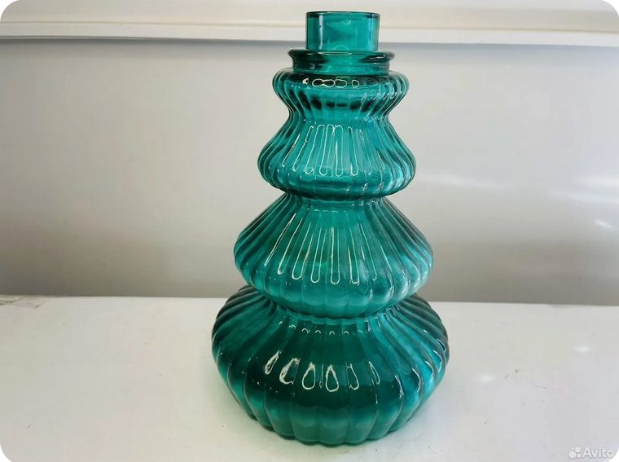
  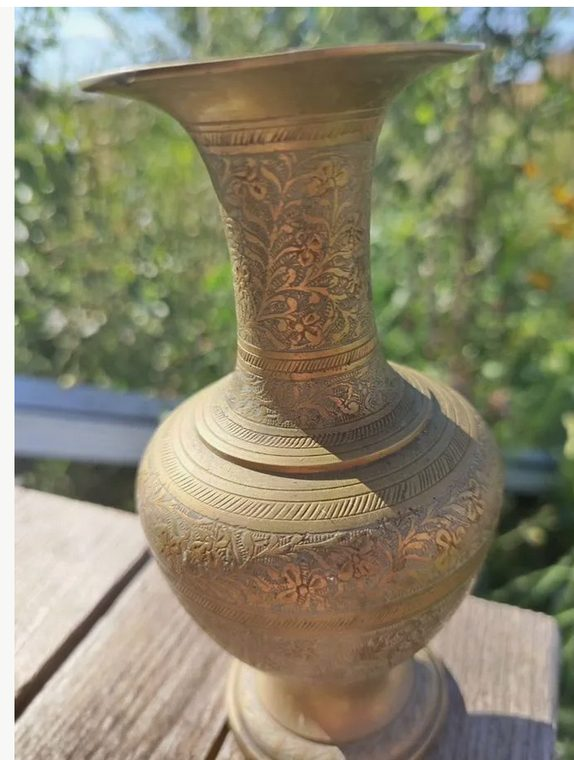
  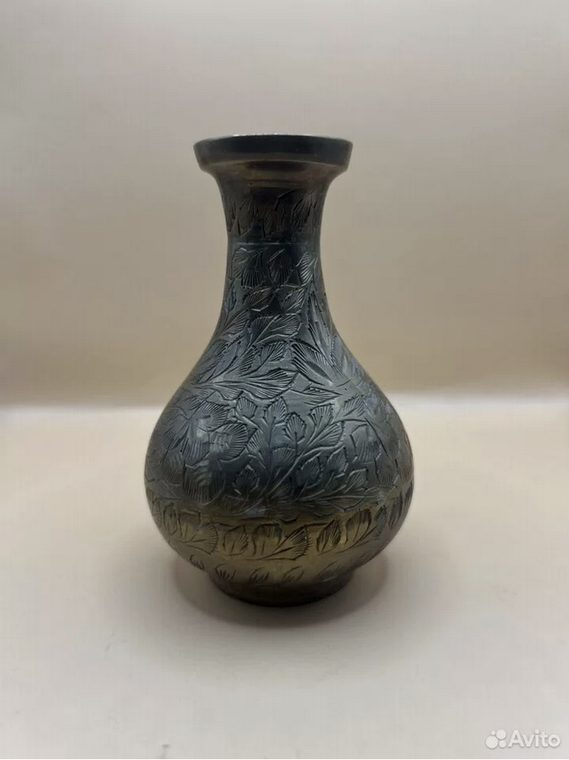

  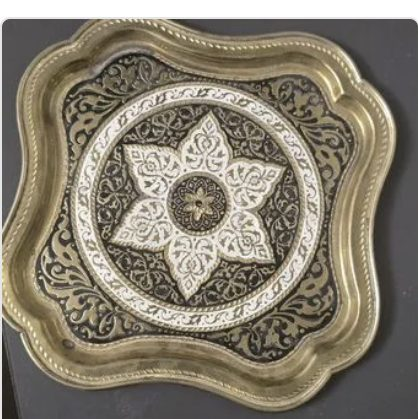
  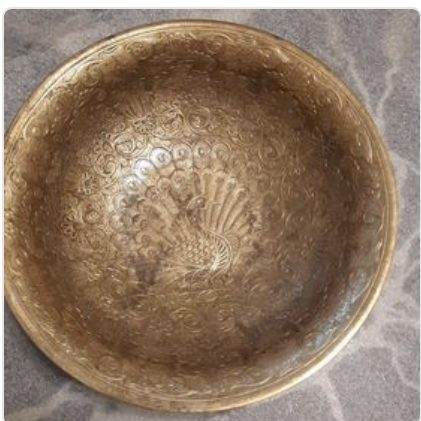
  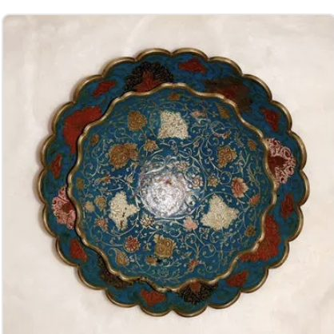

  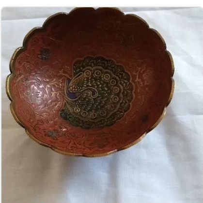
  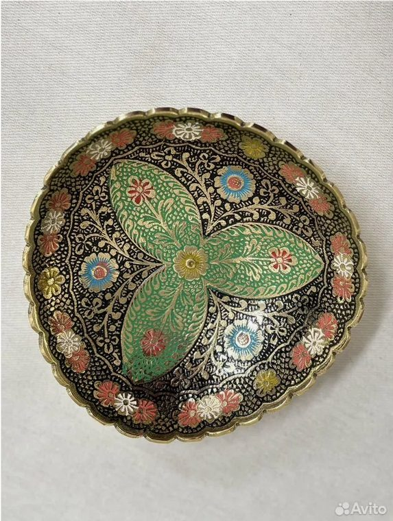
  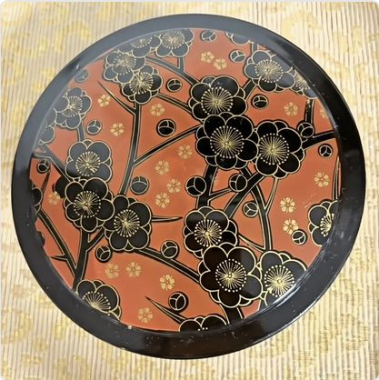

  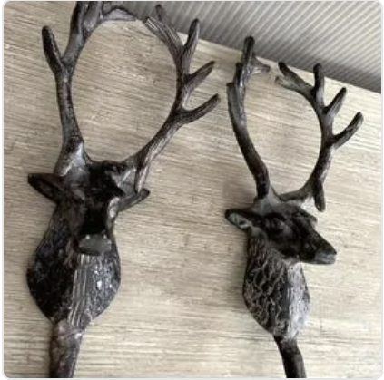
  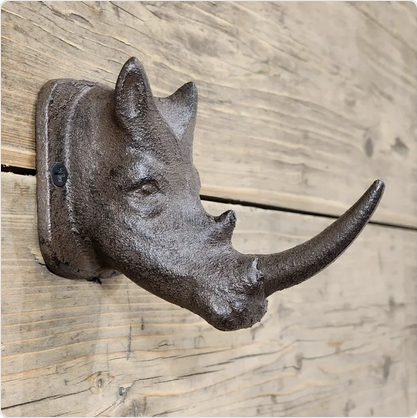
  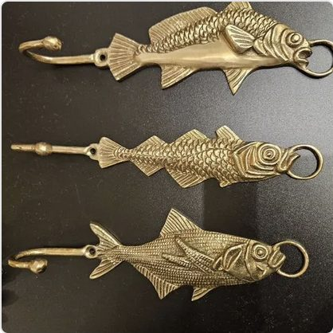

  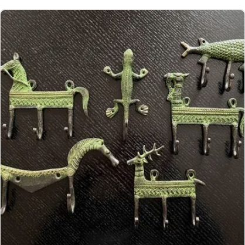
  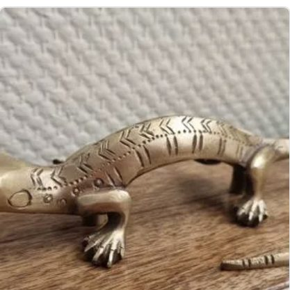

### Основные категории

1. Подносы. Латунные, медные, бронзовые, тёмный металл. Патина, узор приветствуются.

2. Подсвечники. Латунь, бронза, медь, камень. Одиночные или парные.

3. Декоративные чаши и небольшие миски. Для ключей, украшений и прочих мелочей. Латунь, бронза, камень, цветная глазурь.

4. Шкатулки и коробки. Предпочтительно металл или камень. Дерево — если есть инкрустация, маркетри или выразительная отделка.

5. Вазы. Предпочтительно латунные старые, стекло — только если фактурное, рифлёное или действительно интересное. Хочу бахнуть сухо~~фруктов~~цветов!

6. Карты, атласы и схемы, ботанические иллюстрации и гербарии. Не обязательно оригиналы, лучше качественные современные репродукции старых атласов, карт, научных схем, ботанических и зоологических иллюстраций, страниц из книг, литографий. Важнее качество печати, бумаги и оформление, чем возраст самой вещи.

7. Корзины. Лоза, ротанг, дерево, металл. Ну, знаете, как коробка для хранения, только с разнообразием и не из пластика. 

8. Крючки и небольшая фурнитура. Латунь, бронза, тёмный металл. Винтажная или новая под старую фурнитуру.

9. Видела очень классные латунные игольницы!
